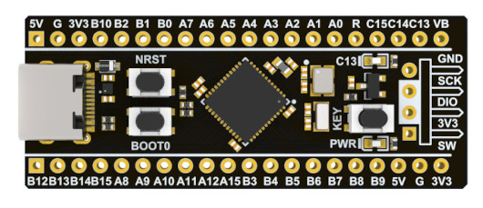

# Programming ARM from Scratch

This is a collection of examples written by myself that show how to
program ARM microcontrollers from scratch.

The examples show how to do bare-metal programming in assembly language,
how to write linker scripts, how to write GNU makefiles and how to switch
from assembly to C programming language without using any IDE or third-party
library or third-party HAL or CMSIS - everything is done from scratch.

## Required Hardware

#### 1. Development board

Development board used in these examples is STM32F411CEU6 black pill v3.1
made by WeAct Studio. It looks like this:

Here is a link to a project page on GitHub:
https://github.com/WeActStudio/WeActStudio.MiniSTM32F4x1

Here is a link to WeAct Studio official store on AliExpress:
https://weactstudio.aliexpress.com

#### 2. Debugger/programmer

Debugger/programmer used in these examples is copy of ST-link V2 that you can
buy on AliExpress. It looks like this:

## Optional Hardware

#### 1. USB to serial port module

This is useful for communicating with microcontroller over UART.

There is a lot of different USB to serial port modules.
I recommend one also made by WeAct Studio.
Check their official store on AliExpress.
Here is a link to a project page on GitHub:
https://github.com/WeActStudio/WeActStudio.USB2SerialV1

#### 2. Logic analyzer

This is useful for debugging while writing drivers for UART, SPI, I2C and similar.

There is a lot of different logic analyzers and some of them are very expensive.
For this purposes you can use the cheapest one.
WeAct Studio has also made logic analyzer and it is preatty cheap.
Check their official store on AliExpress.
Here is a link to a project page on GitHub:
https://github.com/WeActStudio/LogicAnalyzerV1

## Required Software

1.  `arm-none-eabi-gcc`
2.  `arm-none-eabi-binutils`
3.  `arm-none-eabi-gdb`
4.  [`stlink`](https://github.com/stlink-org/stlink)

## Quick start

Create file `example.S` with the following content:

    .syntax unified
    .cpu cortex-m4
    .thumb

    .word 0x20020000
    .word start + 1
    .space 0x3f8

    start:
        nop     @ Do nothing.
        b .     @ Infinite loop.

Run assembler:

    $ arm-none-eabi-as -g example.S -o example.o

Run linker:

    $ arm-none-eabi-ld example.o -o example.elf -Ttext=0x08000000

Connect ST-link debugger/programmer to PC.

Connect development board to ST-link debugger/programmer.
Here is connection diagram:

Do not connect development board to USB.
ST-link debugger/programmer already provides power supply to development board.

Start GDB server by running `st-util` tool:

    $ st-util

GDB server default listen port is 4242.

Open new terminal and start GDB:

    $ arm-none-eabi-gdb example.elf

From GDB connect to server:

    (gdb) target remote :4242

Load program into flash memory:

    (gdb) load

Set breakpoint to program start:

    (gdb) break start

Run program:

    (gdb) continue

Debugger should stop at first line after label `start`
(the line containing command `nop`).

Examine content of CPU registers:

    (gdb) info reg

Execute next instruction:

    (gdb) stepi

Run program:

    (gdb) continue

Interrupt running program by pressing `CTRL + C` key combination:

    (Press CTRL + C)

Stop debugging and exit GDB:

    (gdb) kill
    (gdb) quit

## Using examples

All examples have prepared makefiles.

**Building:**
1. Run `make`.

**Writing program to main flash memory:**
1. Connect ST-link to PC.
2. Connect ST-link to development board.
3. Run `make flash`.

**Debugging:**
1. Connect ST-link to PC.
2. Connect ST-link to development board.
3. Run `make gdb-server`.
4. Open new terminal and run `make gdb`.
